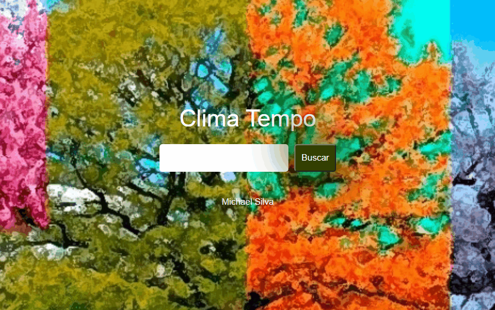

# Clima-Tempo
Projeto que consome uma API que possui os dados sobre o clima, 
ele diz a previsão do clima em tempo real. Este projeto foi construido com base 
em uma aula de aperçoamento das técnicas de programação, sendo perfeiçoado com 
a busca de outros dados e utilizado novas técnicas de programação.

